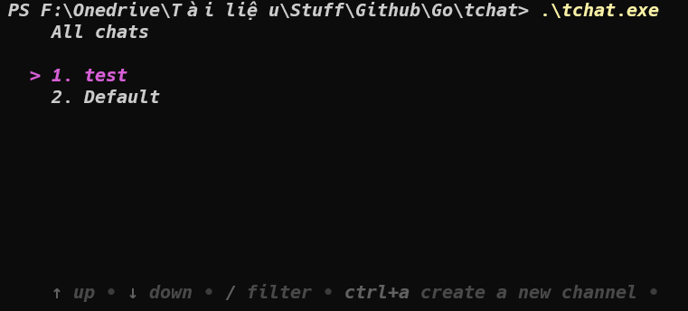

# Terminal chat application

A simple chat application inside the terminal with Golang and Redis Pub/Sub.




## How it works
### How the data is stored:
- The chat data is stored as keys.
   - For each channel contents, the `channel:` is  the prefix key, followed by the channel name.
   - For each message contents, the `message:` is the prefix key, followed by the `channel-name` and the `message-data` in json format.

### How the data is accessed:

- Here is the sample code to access the channel's messages with Go Redis:

```golang
# Get the channel's messages
ctx := context.Background()  
iter := redis.Client.Scan(ctx, 0, fmt.Sprintf("%s%s*", messagePrefix, m.channel), 0).Iterator()  
var messages []string  
for iter.Next(ctx) {  
   rawMsg := iter.Val()  
   rawMsg = strings.Replace(rawMsg, fmt.Sprintf("%s%s:", messagePrefix, m.channel), "", 1)  
   message := Message{}  
   _ = json.Unmarshal([]byte(rawMsg), &message)
   messages = append(messages, formatMessage(message, m.senderStyle))  
}
```

## How to run it locally?
### Prerequisites
- Go - 1.18
### Local installation
- Clone the repository with `git clone` command.
- Copy the `.env.example` file to a new `.env` file.
- Run the `go build` command.
- Run the `./tchat` executable file.

## Deployment

To make deploys work, you need to create free account on [Redis Cloud](https://redis.info/try-free-dev-to)(https://redis.info/try-free-dev-to)  
